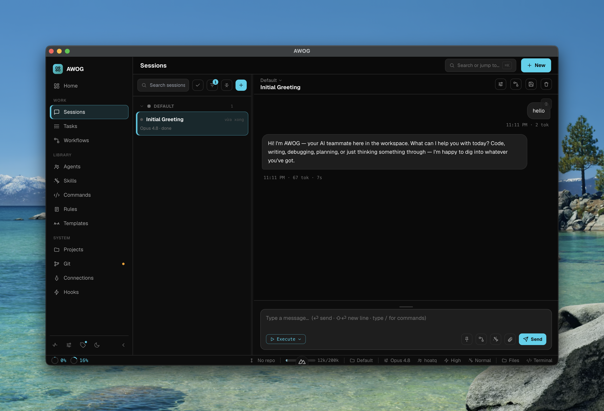

<div align="center">

# AWOG

### Artifact Workflow Orchestrate Guild

**Build AI Teams, Not AI Chats.**

A **local-first AI Team Operating System**, packaged as a cross-platform desktop app.
Instead of chatting with a single agent, you design **guilds** of agents that collaborate
through **artifacts**, **workflows**, and **skills** — with humans in control at every checkpoint.


<br />



</div>

---

Everything runs on your machine. Your code, prompts, and credentials never leave the device
except for the model API calls you explicitly configure.

| | |
|---|---|
| 🌟 **Vision** | [artifacts/VISION.md](artifacts/VISION.md) |
| 📚 **Documentation** | [docs/README.md](docs/README.md) |
| 🧭 **Coding guide** | [docs/coding/](docs/coding/) |
| 🤖 **Guide for Claude Code** | [CLAUDE.md](CLAUDE.md) |

> Project documentation under `docs/` is written in Vietnamese; this README is the
> English-language overview.

## Why AWOG

Most AI tools give you a chat window and a single assistant. Real work needs more: many
specialists, a defined flow between them, durable outputs, and a human who can approve, redirect,
or stop the work at any point. AWOG is built around that reality.

- **Artifacts are the source of truth.** Agents collaborate through artifacts, not through
  chat history.
- **Workflows** define how work flows between agents as a DAG.
- **Skills, Rules, and Slash Commands** shape agent behavior — Skills add capabilities, Rules
  inject workspace instructions into every system prompt, and Commands are reusable prompt
  templates.
- **MCP connections** provide dynamic context and tools; **Hooks** run shell commands on
  lifecycle events.
- **Humans stay in control** through explicit approval checkpoints.

## Features

- **Sessions** — multi-provider chat with streaming, live extended-thinking, plan mode, and
  image attachments that stay in context. Edit & resend, regenerate, retry-with-another-model,
  **rewind** (restore the conversation *and* workspace files from filesystem snapshots —
  [ADR 0038](docs/decisions/0038-session-rewind-fs-snapshots.md)), and Cmd+K cross-session
  search. Right-docked Workspace Panel (Diff / Files / Plan / Terminal / Tasks / Preview) plus
  a Session Info panel.
- **Tasks & Workflows** — run for real through the Pi SDK runtime: a visual DAG builder, a
  parallel scheduler, per-node Git auto-commit, approve / rerun / discuss, and restart-safe
  resume from a JSONL event log.
- **Agents, Skills, Connections (MCP), Rules, Slash Commands, Hooks** — persisted as
  Markdown/JSON across config tiers, with AI-assisted authoring and import from an existing
  Claude Code config. Agents delegate to other agents via a built-in **Task** tool; Rules inject
  into every system prompt; Hooks run shell commands on lifecycle events (trust-gated).
- **Projects & templates** — scaffold a project from a reusable template bundle (local or
  fetched from a GitHub folder), with a per-project default LLM provider / model / account.
- **Git Manager** — a Sublime-Merge-style multi-repo client with staging, hunks, branch tree,
  bulk discard, and background auto-fetch.
- **Auto-update** — wired via `electron-updater` (download-on-consent).

## Architecture

| Layer | Technology |
|---|---|
| Desktop shell | **Electron** (main process runs Node) — window, system tray, single-instance lock, `app://` protocol, auto-update. See [ADR 0027](docs/decisions/0027-tauri-vs-electron-revisit.md) |
| Engine (sidecar) | Node.js package `@awog/sidecar` — spawned via `ELECTRON_RUN_AS_NODE`, **stdio NDJSON JSON-RPC 2.0** |
| Frontend | Nuxt 4 (SPA, `ssr: false`) + Vue 3 + TypeScript + Pinia + VueFlow + TailwindCSS 3 + Monaco |
| LLM runtime | **Pi SDK** (`@earendil-works/pi-ai` + `pi-agent-core`) — single multi-provider runtime (Anthropic / OpenAI / Google / custom), with in-process MCP tools and a subagent **Task** tool for agent-to-agent delegation. See [ADR 0029](docs/decisions/0029-migrate-llm-runtime-to-pi-sdk.md), [ADR 0030](docs/decisions/0030-subagent-task-tool.md) |
| Storage | Local filesystem (JSON / YAML / Markdown) + Git + JSONL event log + OS keychain. Per-user config and credentials live under `~/.awog/` (credentials `chmod 600`); secrets never written to disk in plaintext. See [ADR 0035](docs/decisions/0035-consolidate-config-tiers-to-awog.md) |
| Auto-update | `electron-updater` via GitHub releases, `autoDownload=false`. See [ADR 0028](docs/decisions/0028-auto-update.md) |

Details: [docs/architecture/system-overview.md](docs/architecture/system-overview.md),
[docs/architecture/tech-stack.md](docs/architecture/tech-stack.md).

### Security boundary

The two-process split is a hard security boundary:

- The **UI never imports** `fs`, `child_process`, or any model SDK — all I/O goes through
  sidecar IPC.
- **API keys never leave the sidecar** — they are absent from UI state, logs, events, and IPC
  payloads sent upward.
- **Filesystem and Git operations are scoped to the workspace** — paths are resolved and
  validated against the workspace root before any read/write.

See [.claude/rules/security.md](.claude/rules/security.md) for the full invariant list.

## Repository layout

This is a **pnpm monorepo** (root [`package.json`](package.json) +
[`pnpm-workspace.yaml`](pnpm-workspace.yaml)). The three runnable packages live under
`apps/desktop/`:

```
awog/
├── apps/
│   └── desktop/
│       ├── ui/              # `awog-ui` — Nuxt 4 frontend + engine UI
│       ├── sidecar/         # `@awog/sidecar` — Node.js engine, stdio JSON-RPC
│       └── electron/        # `@awog/desktop` — Electron shell + IPC bridge + updater
├── artifacts/
│   └── VISION.md            # Product vision
├── docs/
│   ├── requirements/        # Functional / non-functional requirements, MVP scope
│   ├── design/              # UX flows, wireframes, visual references
│   ├── architecture/        # System overview, data model, execution model, tech stack
│   ├── decisions/           # ADRs — architecture, technology, scope
│   ├── features/            # Per-feature specifications
│   ├── screenshots/         # Product screenshots used in docs
│   └── coding/              # Coding conventions (general + Nuxt frontend)
├── .github/workflows/       # CI — release.yml (cross-platform build + draft release)
├── package.json             # Root workspace scripts (dev, build, dist, lint, typecheck)
├── pnpm-workspace.yaml       # Declares the three workspace packages
├── CLAUDE.md                # Guide for Claude Code working in this repo
└── README.md
```

## Requirements

- **Node.js** ≥ 20
- **pnpm** ≥ 10 (the repo pins `pnpm@10.33.0` via `packageManager`)
- macOS / Linux / Windows
- A C/C++ toolchain for native modules (`node-pty`) — Xcode Command Line Tools on macOS,
  `build-essential` on Linux, or the Visual Studio Build Tools on Windows.

No Rust toolchain is required (AWOG migrated from Tauri to Electron — see
[ADR 0027](docs/decisions/0027-tauri-vs-electron-revisit.md) and the
[migration notes](docs/features/electron-migration.md)).

## Getting started

```bash
pnpm install                # install dependencies for every workspace package

# Option 1 — full desktop app (UI + sidecar + Electron shell)
pnpm dev                    # build the sidecar, launch Electron, open the app window

# Option 2 — UI only, in the browser (fast, no Electron)
pnpm dev:ui                 # open http://localhost:3030 (engine calls are no-ops)
```

> **Note.** `pnpm dev:ui` runs the UI as a plain web app for fast iteration — engine calls
> (OAuth, sessions, chat streaming, Git, filesystem) are no-ops because there is no sidecar.
> For full integration use `pnpm dev`. See
> [ADR 0008](docs/decisions/0008-stdio-ipc-for-sidecar.md) and
> [ADR 0011](docs/decisions/0011-anthropic-subscription-oauth.md).

### Other commands

```bash
pnpm build                  # build the UI + sidecar
pnpm dist                   # package the desktop app with electron-builder
pnpm electron:rebuild       # rebuild native modules (node-pty) against Electron
pnpm typecheck              # vue-tsc + tsc across all packages
pnpm lint                   # ESLint across all packages
pnpm lint:fix               # auto-fix lint + format
```

`pnpm dist` produces installers via electron-builder: `dmg` / `zip` (macOS), `nsis` (Windows),
`AppImage` / `deb` (Linux). CI uploads them to a **draft** GitHub release for manual review
before publishing.

Pages, stores, themes, and the current port status are documented in
[apps/desktop/ui/README.md](apps/desktop/ui/README.md).

## Status

The desktop app is fully wired on the Electron + Node.js sidecar stack — Sessions, Tasks &
Workflows, Agents / Skills / Connections / Rules / Commands / Hooks, Projects & templates, the
Git Manager, and auto-update are all functional. See the [Features](#features) section above for
detail, and the per-area roadmap in
[apps/desktop/ui/README.md](apps/desktop/ui/README.md#roadmap).

## Contributing

1. Read [docs/requirements/](docs/requirements/) to understand the MVP scope.
2. Read [docs/architecture/](docs/architecture/) to understand the runtime model.
3. Follow [docs/coding/](docs/coding/) when writing code.
4. Every significant architectural decision ⇒ a new ADR in [docs/decisions/](docs/decisions/).
</content>
</invoke>
