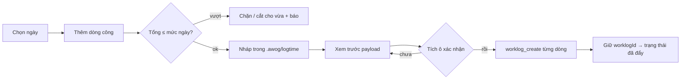

# Feature: Logtime

**Trạng thái:** P1 implemented (2026-09-21) — contract: [ADR 0091](../decisions/0091-logtime-worklog-via-mcp.md)

## Đã ship / chưa ship

| | Trạng thái |
|---|---|
| Store 1 file/tháng ở `~/.awog/logtime/<YYYY-MM>.json` + settings ở `~/.awog/logtime/settings.json` | ✅ |
| 12 RPC `logtime.*` (month · save-day · capabilities · projects · tasks · push · pull · suggestions · compose · composeLine · settings-get · settings-set) | ✅ |
| Dò năng lực từng nguồn bằng `tools/list` (không hard-code adapter từng PMS) | ✅ |
| Đẩy lên PMS qua MCP `worklog_create`, **hai bước xác nhận**, kết quả từng dòng | ✅ |
| Kéo về (`worklog_list`) để biết dòng nào đã có trên PMS / đã khoá | ✅ |
| Nối dự án AWOG ↔ nguồn ↔ dự án PMS, chọn task từ `worklog_list_tasks` | ✅ |
| Mức giờ/ngày, bậc làm tròn, giờ nhắc — **cấu hình được**, không ghi cứng | ✅ |
| Trang `/logtime`: cột ngày · thanh ngân sách · dòng công · form nhanh · thanh xác nhận | ✅ |
| Báo cáo ngày 3 dạng (gọn / bảng markdown / JSON payload) | ✅ |
| **Tool cho phiên chat**: `logtime_day` · `logtime_projects` · `logtime_add` · `logtime_remove` (cả 2 runtime) | ✅ |
| **Sự kiện `logtime.changed`** → trang đang mở tự nạp lại khi agent/PMS ghi | ✅ |
| Gợi ý dòng công từ **phiên + tác vụ** AWOG trong ngày (panel "Hôm nay bạn đã làm" — **cột phải**, chỉ dự án đã nối PMS, RPC `logtime.suggestions`) | ✅ |
| Bấm "Đưa vào form" → **AI tóm tắt tiêu đề thô thành note tiếng Việt** (`logtime.composeLine`) + gắn link issue; dòng nhớ `sourceRefId` để thẻ nhận ra "đã khai" dù note đã đổi | ✅ |
| Soạn bằng AI (RPC `logtime.compose` → model soạn dòng nháp; nhận vẫn qua `addEntry`, đẩy vẫn là bước riêng) | ✅ |
| Màn **Tuần**: 4 tile + bảng dự án × 7 ngày (heat chip nháp/đã đẩy) + báo cáo tuần | ✅ |
| Tab bar: segment `Ngày | Tuần` + **Thiết lập dạng icon bánh răng** + nút Soạn bằng AI | ✅ |
| Tự đặt mức 0h cho ngày lễ / nghỉ phép (`holiday_list`, `leave_list`) | ⏳ chờ scope |
| Màn tháng + xuất CSV | ⏳ P2 |

## Overview

**Logtime** là nơi soạn giờ công mỗi ngày trong AWOG rồi **đẩy lên các PMS qua MCP**. Bài toán: mỗi ngày phải khai tối đa 8h, làm trên nhiều dự án thuộc nhiều hệ PMS khác nhau, mỗi hệ một giao diện — kết quả là cuối ngày ngồi nhớ lại rồi gõ tay vào từng chỗ.

Logtime lật ngược: **soạn một chỗ, đẩy đi nhiều nơi**. Dòng công sống ở AWOG dưới dạng *nháp* cho tới khi người dùng xác nhận; lúc đó AWOG gọi `worklog_create` trên đúng nguồn MCP của từng dự án và giữ lại `worklogId` trả về để sau này sửa/xoá.

Logtime **không phải** bảng chấm công của công ty — nguồn sự thật vẫn là PMS. Nó là lớp soạn thảo + lớp gom nhiều PMS, và mọi thao tác ghi đều đi qua MCP của chính PMS đó.

## User stories

- *Là dev làm 3 dự án*, tôi muốn thấy hôm nay đã khai bao nhiêu trên tổng 8h và thiếu bao nhiêu, để không bị nhắc cuối tuần.
- *Là dev*, tôi muốn gõ một dòng "làm gì · mấy tiếng · dự án nào" trong 5 giây, không phải mở 2 trang web.
- *Là dev*, tôi muốn AWOG **chặn** khi tôi lỡ khai quá mức, thay vì để PMS nhận rồi kế toán trả về.
- *Là dev*, tôi muốn gắn issue GitHub vào dòng công để quản lý biết giờ đó đổ vào task nào.
- *Là người cẩn thận*, tôi muốn **nhìn thấy payload** sắp gửi và tự bấm xác nhận — không có chuyện AWOG tự ghi lên hệ thống công ty.
- *Là người mới đổi máy*, tôi muốn mở app lên là thấy những gì đã khai trên PMS, không phải nhớ.

## Luồng chính



Ba trạng thái của một dòng công:

| Trạng thái | Nghĩa | Sửa được? |
|---|---|---|
| `draft` | chỉ nằm ở AWOG, PMS chưa biết | có |
| `posted` | đã có `worklogId` từ PMS | có (qua `worklog_update`) |
| `locked` | PMS đặt `lockedAt` (kỳ công đã chốt) | không |

## Mô hình dữ liệu

Một file JSON cho mỗi tháng, `~/.awog/logtime/2026-09.json`:

```jsonc
{
  "month": "2026-09",
  "days": {
    "2026-09-18": {
      "entries": [
        {
          "id": "lt_01a0…",              // id nội bộ của AWOG, KHÔNG phải worklogId
          "projectKey": "168-yahagi-panwall", // khoá nối, xem settings.links
          "note": "Dựng lại pipeline deploy justdb",
          "hours": 2.5,
          "task": { "id": "019fb19c-…", "issue": 189, "title": "…" },
          "status": "draft",
          "worklogId": null,             // có sau khi đẩy
          "lockedAt": null,
          "updatedAt": 1789900000000
        }
      ]
    }
  }
}
```

Cấu hình ở `~/.awog/logtime/settings.json`:

```jsonc
{
  "dailyHours": 8,          // mức giờ mỗi ngày, 0–24
  "roundStep": 0.5,         // bậc làm tròn LÊN: 0.25 | 0.5 | 1
  "remindAt": "17:30",      // "" = tắt nhắc
  "remindEnabled": true,
  "links": [                // dự án AWOG → nguồn → dự án PMS
    { "projectKey": "168-yahagi-panwall", "sourceId": "papay-pms_a3f7c921",
      "pmsProjectId": "019efd61-…", "pmsProjectName": "YAHAGI 168",
      "githubRepo": "structuralengine/168-yahagi-panwall" }
  ]
}
```

**Vì sao 1 file/tháng** chứ không phải 1 file/ngày hay một DB: một tháng là đơn vị người dùng nhìn (báo cáo tháng), file ~20–40KB đọc/ghi một nhát, và không đẻ ra 365 file mỗi năm. Xem [ADR 0091](../decisions/0091-logtime-worklog-via-mcp.md).

## Hợp đồng MCP

Logtime **không biết PMS nào cả**. Nó chỉ biết 7 năng lực, và dò xem nguồn có tool tương ứng không:

| Năng lực Logtime | Tool MCP | Bắt buộc? |
|---|---|---|
| Liệt kê dự án | `worklog_list_projects` | có |
| Ghi giờ | `worklog_create` | có |
| Liệt kê task | `worklog_list_tasks` | không (thiếu thì ẩn nút Gắn task) |
| Đọc lại ngày | `worklog_list` | không (thiếu thì không kéo về được) |
| Sửa giờ | `worklog_update` | không |
| Xoá dòng | `worklog_delete` | không |
| Đọc 1 dòng | `worklog_get` | không |

Nguồn thiếu `worklog_create` → Logtime để **chỉ đọc**, dự án nối vào đó không đẩy được và UI nói rõ lý do. Thêm PMS mới chỉ cần đặt tên tool theo quy ước này, **không phải sửa code AWOG**.

Shape đã kiểm trên `pms.papay.vn/mcp` (2026-09-21):

- `worklog_list_projects(q?)` → `[{ label, value }]` (`value` = projectId uuid v7)
- `worklog_list_tasks(projectId, q?)` → `[{ label: "#134 · tiêu đề", value: taskId }]`; `q` dạng số khớp luôn GitHub issue id
- `worklog_create(projectId, date, hours, note?, taskIds?[], githubIssueUrls?[])` — `date` = `YYYY-MM-DD`, `hours` 0.25–24, **phải có ít nhất một** trong `taskIds` / `githubIssueUrls` / `note`
- `worklog_list({from,to,projectId?,page?,pageSize?})` → `{ rows, total, page, pageSize, sumHours }`, mỗi row có `tasks[]` + `lockedAt`
- `worklog_update(id, …)` / `worklog_delete(id)` / `worklog_get(id)`

⚠️ **`githubIssueUrls` chỉ nhận link ISSUE.** Đưa link PR vào làm server trả `createError is not defined` (đo 2026-09-18). Link PR phải nằm trong `note`.

⚠️ **`hours` trả về là chuỗi** (`"3"`) trong khi gửi đi là số — parse lại khi kéo về.

## Phiên chat tương tác được

Một phiên AWOG trả lời được "hôm nay tôi khai mấy tiếng rồi?" và ghi hộ một dòng, thay vì bắt người dùng rời chat sang trang Logtime.

| Tool | Làm gì | Ghi? |
|---|---|---|
| `logtime_day(date?)` | Tổng đã khai / mức ngày + từng dòng kèm trạng thái và `id` | không |
| `logtime_projects()` | Dự án đã nối PMS (tên dùng cho `logtime_add`) + mức giờ + bậc làm tròn | không |
| `logtime_add({project, note, hours, date?, issue?})` | Thêm một dòng **nháp** | có |
| `logtime_remove({entryId, date?})` | Xoá một dòng **nháp** | có |

Bốn ràng buộc, mỗi cái là một quyết định:

1. **Không có tool đẩy lên PMS.** ADR 0091 D-5 — agent soạn nháp, nút Đẩy vẫn ở trang Logtime.
2. **`logtime_add` đi qua `addEntryGated`** — cùng cổng trần giờ mà UI dùng, nên một phiên chat không khai nổi 20h/ngày.
3. **Chỉ xoá được dòng `draft`.** Dòng đã đẩy còn sống trên PMS; xoá ở AWOG chỉ làm hai bên lệch.
4. **Tên dự án khớp mềm** (khoá → tên đúng → chứa chuỗi), nhưng phải là dự án **đã nối**. Không tìm thấy thì lỗi liệt kê luôn các tên hợp lệ.

Hai tool ghi đi qua cổng quyền từng lời gọi (`permission.ts`) như `wiki_write`, và bộ tool **chỉ tồn tại khi đã nối ít nhất một dự án với PMS** — ai không dùng Logtime không trả token schema nào.

Trên nhánh Claude SDK, bộ tool này là server MCP in-process `awoglogtime` → `mcp__awoglogtime__logtime_*`; tên được gấp/nở tự động qua `runtime/tools/bridged.ts` nên `allowedTools` của AGENT.md viết tên trần vẫn khớp.

## Sự kiện

`logtime.changed` được phát sau **mọi** lần ghi:

```jsonc
{ "date": "2026-09-21", "month": "2026-09", "source": "user" | "agent" | "push" | "pull" }
```

Trang `/logtime` đang mở subscribe sự kiện này: agent thêm một dòng trong chat thì danh sách + thanh ngân sách đổi ngay, kèm chip *"phiên chat vừa cập nhật"* để con số không tự nhảy một cách khó hiểu. Sự kiện của tháng khác bị bỏ qua (mỗi lúc chỉ giữ một tháng trong bộ nhớ).

## Luật giờ

Cổng thêm dòng có **hai bản, cố ý**: `stores/logtime.ts` (UI, phản hồi tức thì) và `addEntryGated` ở sidecar (đường của agent — không đi qua UI). Cùng một luật, và không đường nào vượt mức được:

1. Ngày đã đủ mức → **từ chối**, nêu lý do.
2. Còn chỗ nhưng không đủ → **cắt cho vừa** và nói rõ đã cắt từ bao nhiêu xuống bao nhiêu.
3. Trùng (cùng dự án + cùng note trong ngày) → bỏ qua, không đẻ bản sao.

Mức ngày, bậc làm tròn, giờ nhắc đều ở Thiết lập. Đổi mức là mọi thứ đổi theo: nhãn, vạch chia, trạng thái thiếu/đủ/vượt, giờ suy ra từ gợi ý, bước nhảy của nút ±.

## Acceptance criteria

1. **Given** ngày 18/09 đang có 6.5h và mức 8h, **when** thêm dòng 2h, **then** dòng vào với 1.5h và có thông báo nêu đã cắt từ 2h.
2. **Given** ngày đã đủ mức, **when** bấm "Chép hôm qua", **then** không dòng nào được thêm và nút chuyển sang vô hiệu.
3. **Given** 4 dòng nháp trên 1 nguồn, **when** mở hộp thoại đẩy, **then** nút xác nhận **bị khoá** cho tới khi tích ô, và chưa có lời gọi MCP nào.
4. **Given** đã tích ô và bấm xác nhận, **when** `worklog_create` trả về, **then** từng dòng có `worklogId`, trạng thái đổi sang `posted`, và ngày hiện "không còn dòng nháp".
5. **Given** một dòng có gắn task #134, **when** xem payload, **then** thấy `taskIds:["01a08b31-…"]` và `githubIssueUrls:["…/issues/134"]`.
6. **Given** nguồn không có `worklog_create`, **when** đẩy, **then** các dòng thuộc nguồn đó hiện "bỏ qua" ngay ở bước xem trước, không gửi đi.
7. **Given** PMS đã có 8h cho ngày 17/09, **when** bấm kéo về, **then** 5 dòng hiện đúng giờ + note + trạng thái `posted`/`locked` theo `lockedAt`.
8. **Given** đổi mức ngày từ 8 xuống 6, **when** quay lại màn ngày, **then** nhãn, vạch chia và trạng thái đủ/thiếu/vượt tính lại theo 6.

## Edge case

| Ca | Xử lý |
|---|---|
| Token thiếu `worklog:write` | Nguồn hiện cảnh báo, dự án nối vào bị chặn đẩy ngay từ UI |
| Token thiếu `holiday:read` / `leave:read` | Tool có nhưng không gọi được → nêu đúng scope còn thiếu, không im lặng |
| Đẩy nửa chừng lỗi | Gọi **tuần tự**, dòng nào đã ghi giữ `worklogId`, dòng lỗi vẫn là nháp + hiện lỗi của chính dòng đó |
| PMS khoá kỳ công | `lockedAt` ≠ null → dòng chuyển `locked`, ẩn nút sửa/xoá |
| Dự án chưa nối PMS | Dòng vẫn soạn được (để không chặn việc ghi chép) nhưng gắn cờ đỏ và không đẩy |
| Mất mạng giữa lúc đẩy | Lỗi transport → dòng giữ nguyên nháp, không có trạng thái "nửa vời" |
| Hai máy cùng sửa một tháng | File ghi atomic (tmp + rename); máy sau ghi đè — **chấp nhận** trong P1, nguồn sự thật là PMS |
| Agent ghi trong lúc người dùng đang mở trang | `logtime.changed` → trang tự nạp lại + chip báo nguồn thay đổi |
| `saveDay` nhận tổng vượt mức (từ `logtime.pull`) | **Không chặn** — PMS là nguồn sự thật; trần chỉ chặn đường THÊM MỚI |
| Đổi mức ngày xuống dưới tổng đã khai | Không tự xoá gì; ngày hiện "Vượt Xh" màu đỏ để người dùng tự xử lý |

## Không làm (cố ý)

- **Không tự đẩy.** Ghi lên hệ thống công ty là thao tác ra ngoài, luôn cần người bấm.
- **Không bấm giờ (timer).** AWOG đã có thời lượng phiên/tác vụ; thêm nút start/stop là thêm một thứ phải nhớ tắt.
- **Không đồng bộ hai chiều tự động.** Kéo về là hành động có chủ ý, tránh cảnh nháp bị PMS ghi đè lúc đang gõ.
- **Không quản lý nghỉ phép.** `leave_*` chỉ dùng để biết ngày nào mức 0h, không phải để tạo đơn.

## Tham chiếu

- [ADR 0091 — Logtime ghi worklog qua MCP](../decisions/0091-logtime-worklog-via-mcp.md)
- [ADR 0025 — Connections Manager](../decisions/0025-connections-manager.md) (nguồn MCP dùng chung)
- [ADR 0018 — MCP secret trong keychain](../decisions/0018-mcp-secret-keychain.md) (token PMS không bao giờ vào file/git)
