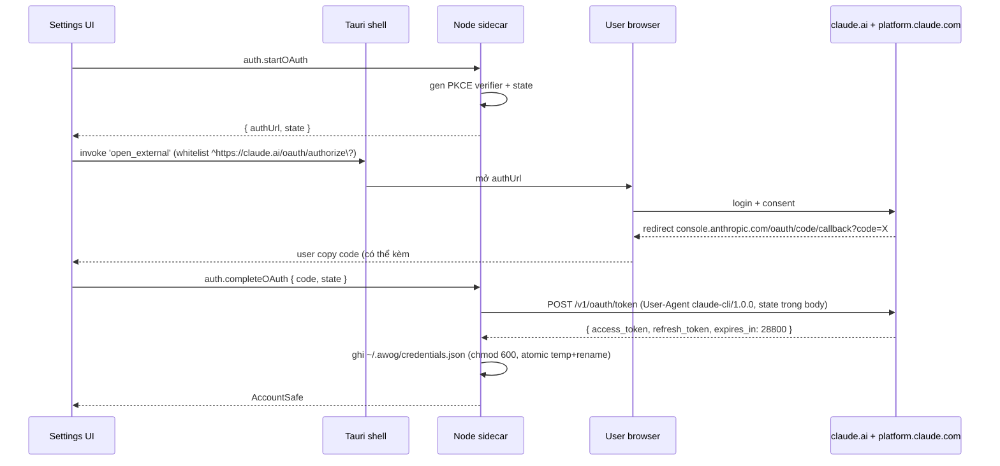

# Feature: Models & Accounts

**Trạng thái:** Wired (M7) — Anthropic OAuth Pro/Max đã hoạt động. API key + multi-provider thuộc roadmap.

## Mục đích

Section Settings → **Models & API Keys** là chỗ user kết nối AWOG với tài khoản Anthropic (và sau này: OpenAI, Google, custom provider). Ưu tiên M7: **subscription Claude Pro / Max** qua OAuth, để user 1-click sign-in mà không cần signup Console hay nạp credit.

API key (Anthropic Console) là phương án roadmap, không gấp ở M7 vì:

- User dùng Pro/Max sẵn có quota, không cần trả tiền API thêm.
- Dev cũng dùng Pro của bản thân khi test → onboarding chi phí $0.

## OAuth flow (Claude Pro/Max)



3 bước user-visible:

1. Click **"Sign in with Claude"** → dialog hiện authUrl + nút "Open browser".
2. User login trên `claude.ai` → Anthropic redirect tới `console.anthropic.com/oauth/code/callback` hiển thị code.
3. User paste code (có hoặc không kèm `#state` suffix) vào dialog → submit → AWOG xác thực + lưu account.

UI component: [`apps/desktop/ui/components/settings/SettingsOAuthCodeDialog.vue`](../../apps/desktop/ui/components/settings/SettingsOAuthCodeDialog.vue).

## `credentials.json` shape

Lưu tại `~/.awog/credentials.json`, **chỉ sidecar đọc**. Không bao giờ đi qua IPC ra UI.

```jsonc
{
  "version": 1,
  "activeAccountId": "anthropic-oauth-7f3a",
  "accounts": [
    {
      "id": "anthropic-oauth-7f3a",
      "provider": "anthropic",
      "authMode": "oauth-subscription",
      "label": "Claude Max — user@example.com",
      "accessToken": "sk-ant-oat01-...",       // raw, KHÔNG ra UI
      "refreshToken": "sk-ant-ort01-...",      // raw, KHÔNG ra UI
      "expiresAt": "2026-05-27T18:00:00.000Z",
      "scopes": ["org:create_api_key", "user:profile", "user:inference"],
      "createdAt": "2026-05-27T10:00:00.000Z",
      "updatedAt": "2026-05-27T10:00:00.000Z"
    }
  ]
}
```

File mode `0600` (owner read/write only). Ghi atomic: `credentials.json.tmp` → `fsync` → `rename`.

## `AccountSafe` shape (UI nhận)

UI **chỉ** thấy DTO an toàn, không có raw token:

```ts
type AccountSafe = {
  id: string
  provider: 'anthropic'
  authMode: 'oauth-subscription' | 'api-key'  // 'api-key' chưa wire ở M7
  label: string
  fingerprint: string          // sha256(refreshToken).slice(0, 8), runtime-derived
  expiresAt: string            // ISO
  scopes: string[]
  status: 'connected' | 'expired' | 'disconnected'
  isActive: boolean
  createdAt: string
  updatedAt: string
}
```

`fingerprint` được sidecar derive **runtime** mỗi lần serialize ra UI — **không lưu** xuống file. Mục đích: cho user phân biệt 2 account cùng provider mà không lộ token.

## Status states

Derive trong sidecar trước khi trả về UI:

| `status` | Điều kiện | UI hiển thị |
|---|---|---|
| `connected` | `expiresAt > now` HOẶC refresh OK trong lần test gần nhất | Chip xanh "Connected" |
| `expired` | `expiresAt < now` VÀ refresh fail | Chip vàng "Refresh failed — sign in again" |
| `disconnected` | Account vừa bị `accounts.remove` (không còn trong list) | (Không hiển thị, đã xóa) |

## Token lifecycle

| Tình huống | Hành động |
|---|---|
| Access token expiry | 8h (`expires_in: 28800`) từ Anthropic. |
| Lazy refresh | `token-manager` check `expiresAt - now < 5 * 60_000` trước mỗi request `/v1/messages`. Đủ window → refresh ngay. |
| 401 từ `/v1/messages` | Force refresh (bỏ qua window) + retry 1 lần. Vẫn fail → propagate `AUTH_EXPIRED`. |
| Mỗi refresh response | Trả về **cả** `access_token` **và** `refresh_token` mới → overwrite cả 2 trong file (atomic) và memory cache. Đây là quirk Anthropic, không có trong OAuth spec chuẩn. |
| Sign-in lại | User bấm lại "Sign in with Claude" → flow PKCE mới → ghi đè account cũ cùng provider (giữ id ổn định nếu có thể). |

Xem [ADR 0011](../decisions/0011-anthropic-subscription-oauth.md) để biết chi tiết các quirk.

## Test button

UI nút **"Test connection"** trong account row → RPC `accounts.test`:

1. Sidecar gọi `POST /v1/messages` với model rẻ nhất (Claude Haiku) + `max_tokens: 1`.
2. Nếu 200 → trả `{ ok: true, expiresInMs }`.
3. Nếu 401 → force refresh + retry 1 lần.
4. UI hiển thị toast: "Connected — expires in 7h 42m" hoặc lỗi cụ thể.

## RPC method

| Method | Params | Trả về | Ghi chú |
|---|---|---|---|
| `accounts.list` | — | `AccountSafe[]` | Đã derive `fingerprint` + `status`. |
| `accounts.remove` | `{ id }` | `{ ok: true }` | Xóa entry khỏi `credentials.json`. Nếu là active → clear `activeAccountId`. |
| `accounts.setActive` | `{ id }` | `AccountSafe` | Set `activeAccountId`. Tất cả request `/v1/messages` sau đó dùng account này. |
| `accounts.test` | `{ id? }` | `{ ok, expiresInMs?, error? }` | Default test active account. |
| `auth.startOAuth` | — | `{ authUrl, state }` | Sinh PKCE; state lưu trong memory chờ `completeOAuth`. |
| `auth.completeOAuth` | `{ code, state? }` | `AccountSafe` | Exchange code → token, upsert account. |

## Security

8 invariant AWOG (xem [.claude/rules/security.md](../../.claude/rules/security.md)) áp dụng:

- **Raw token KHÔNG ra khỏi sidecar** — `AccountSafe` là cổng duy nhất ra UI. Mọi event/trace/log cũng không chứa raw token.
- **`credentials.json` chmod 600** + atomic write (temp + `fsync` + rename).
- **Logger mask** trường tên match `/token|key|credential|authorization/i` → in `[REDACTED]`.
- **UI cấm import** `@anthropic-ai/sdk`, `fs`, `child_process`, hay bất kỳ module gọi trực tiếp `claude.ai`. Mọi việc đi qua RPC.
- **Whitelist `open_external`**: chỉ URL khớp `^https://claude.ai/oauth/authorize\?` được mở (xem [Tauri capability](../../apps/desktop/src-tauri/capabilities/)) — chống phishing redirect.
- **State validation**: `auth.completeOAuth` reject nếu `state` không khớp với giá trị sinh ở `startOAuth`. Tránh CSRF.

## TODO post-M7

- **OS keychain migration** ([ADR 0001](../decisions/0001-local-first-storage.md) tracker): chuyển raw token từ `~/.awog/credentials.json` sang Keychain (macOS) / Credential Manager (Win) / Secret Service (Linux). File giữ lại metadata không nhạy cảm.
- **API key auth mode** cho Anthropic (Console). Cùng infrastructure account, khác `authMode`.
- **OpenAI provider** + GPT model family. Cần định nghĩa `ModelAdapter` interface (open-closed).
- **Google provider** (Gemini API).
- **Custom provider** (OpenRouter, Ollama, vLLM local) — phải qua SSRF guard (allowlist host, chặn private IP, validate redirect).
- **Multi-account same provider** (vd 2 tài khoản Pro để tăng quota) — UI hiện đã support, sidecar chỉ cần ổn định `accounts.setActive`.
- **Auto-rotate khi 429** — hiện đang dùng pause-on-quota (xem [ADR 0010](../decisions/0010-pause-on-quota-for-connection-switch.md)), auto-rotate nếu có multi-key pool sẽ là V2.

## Files chính

### UI

- [`apps/desktop/ui/components/settings/SettingsModelsSection.vue`](../../apps/desktop/ui/components/settings/SettingsModelsSection.vue) — section list accounts + sign-in CTA.
- [`apps/desktop/ui/components/settings/SettingsOAuthCodeDialog.vue`](../../apps/desktop/ui/components/settings/SettingsOAuthCodeDialog.vue) — 3-step dialog.
- [`apps/desktop/ui/stores/settings.ts`](../../apps/desktop/ui/stores/settings.ts) — Pinia store, action `signInAnthropic`, `removeAccount`, `setActive`, `testAccount`.
- [`apps/desktop/ui/composables/useSidecar.ts`](../../apps/desktop/ui/composables/useSidecar.ts) — RPC wrapper.

### Sidecar

- [`apps/desktop/sidecar/src/auth/`](../../apps/desktop/sidecar/src/auth/) — PKCE generator, OAuth flow, state cache.
- [`apps/desktop/sidecar/src/credentials/`](../../apps/desktop/sidecar/src/credentials/) — `credentials.json` reader/writer (chmod, atomic).
- [`apps/desktop/sidecar/src/providers/anthropic/`](../../apps/desktop/sidecar/src/providers/) — `model-client`, `token-manager` (refresh logic).
- [`apps/desktop/sidecar/src/methods/`](../../apps/desktop/sidecar/src/methods/) — RPC handler `accounts.*` + `auth.*`.

## Tham chiếu

- [ADR 0011](../decisions/0011-anthropic-subscription-oauth.md) — chọn OAuth subscription trước API key (M0 verify date).
- [ADR 0010](../decisions/0010-pause-on-quota-for-connection-switch.md) — pause khi 429 quota.
- [ADR 0008](../decisions/0008-stdio-ipc-for-sidecar.md) — protocol IPC.
- [.claude/rules/security.md](../../.claude/rules/security.md) — 8 invariant.
- [sessions.md](./sessions.md) — feature consume `/v1/messages`.
