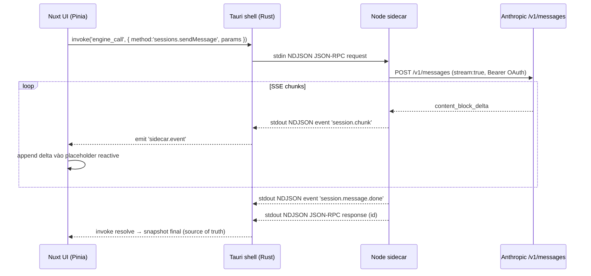

# Feature: Sessions

**Trạng thái:** Wired (M7) — đã nối với Node.js sidecar + Anthropic Pro/Max OAuth.

## Mục đích

`Sessions` là chỗ user **chat free-form với Claude** trong AWOG, không gắn workflow, không gắn agent persona, lưu lịch sử local. Mục tiêu: thay thế việc mở web `claude.ai` cho các tình huống "hỏi nhanh", "scratch pad", "research mở", trong khi vẫn tận dụng subscription Pro/Max mà user đã trả tiền.

## Khác Task

Session = thảo luận tự do (linear chat, không status pipeline, không approval). Task = đơn vị deliverable có workflow DAG, agent cố định, approval gate, artifact đầu ra. Xem chi tiết paradigm separation trong [MEMORY.md](../../MEMORY.md) (`feedback_session_vs_task.md`).

## Data flow



Tham chiếu kiến trúc: [ADR 0006](../decisions/0006-tauri-shell-for-nuxt.md), [ADR 0008](../decisions/0008-stdio-ipc-for-sidecar.md).

## RPC method

| Method | Params | Trả về | Ghi chú |
|---|---|---|---|
| `sessions.list` | — | `Session[]` (snapshot fold) | Đọc toàn bộ `~/.awog/sessions/*.jsonl`, fold event → snapshot trong RAM. |
| `sessions.upsert` | `{ mode: 'create' \| 'update-metadata', session }` | `Session` | Ghi event `session.created` hoặc `session.metadata.updated`. |
| `sessions.delete` | `{ id }` | `{ ok: true }` | Ghi event `session.deleted` (tombstone), file JSONL giữ lại cho forensics. |
| `sessions.sendMessage` | `{ sessionId, content, model? }` | `{ messageId, finalMessage }` | Streaming. Sidecar tự append cả user + agent message vào JSONL. UI nhận chunks qua event channel; response RPC = source of truth khi xong. |

UI gọi qua composable `useSidecar()` ([apps/desktop/ui/composables/useSidecar.ts](../../apps/desktop/ui/composables/useSidecar.ts)), wrap `invoke('engine_call', …)`.

## Persistence

Append-only JSONL tại `~/.awog/sessions/<sessionId>.jsonl`. 4 event types:

| Event | Trigger | Body chính |
|---|---|---|
| `session.created` | `sessions.upsert` mode `create` | `{ id, title, createdAt }` |
| `session.metadata.updated` | rename, pin, set model | partial metadata |
| `message.appended` | trong `sessions.sendMessage` (cả user lẫn agent) | `{ messageId, role, content, model, tokensIn, tokensOut, durationMs }` |
| `session.deleted` | `sessions.delete` | `{ deletedAt }` |

Khi load (`sessions.list`):

1. Đọc tất cả file JSONL trong `~/.awog/sessions/`.
2. Mỗi file fold tuần tự event → snapshot `Session`.
3. Bỏ qua session có event `session.deleted` cuối cùng (vẫn giữ file).

File preserve sau delete để có thể audit hoặc khôi phục thủ công.

## Streaming protocol

Sidecar emit qua channel `sidecar.event` (Tauri event, không phải JSON-RPC response):

```jsonc
// notification (no id)
{ "jsonrpc": "2.0", "method": "event",
  "params": { "type": "session.chunk",
              "payload": { "sessionId", "messageId", "delta": "..." } } }
{ "jsonrpc": "2.0", "method": "event",
  "params": { "type": "session.message.done",
              "payload": { "sessionId", "messageId", "tokensIn", "tokensOut", "model" } } }
```

UI side:

1. Trước khi gọi `sessions.sendMessage`, store push placeholder message `{ role: 'assistant', content: '', pending: true }` với `messageId` tạm.
2. Subscribe `sidecar.event`, filter `payload.sessionId + payload.messageId`.
3. Mỗi `session.chunk` → append `delta` vào content placeholder (reactive ref).
4. `session.message.done` → mark `pending: false`.
5. RPC response (resolved) → replace placeholder bằng `finalMessage` (đề phòng lệch giữa stream view và payload thật).

## Auto-refresh OAuth

Khi `/v1/messages` trả `401`, sidecar `model-client`:

1. Gọi `token-manager.forceRefresh()` (bỏ qua window 5 phút, refresh ngay).
2. Retry request 1 lần với access token mới.
3. Nếu vẫn 401 → propagate error `AUTH_EXPIRED` ra RPC; UI prompt sign-in lại.

Mỗi refresh response trả `refresh_token` mới → overwrite cả `accessToken` lẫn `refreshToken` trong `credentials.json` và memory cache. Xem [ADR 0011](../decisions/0011-anthropic-subscription-oauth.md).

## Limitations (M7)

- Chỉ text (chưa multimodal: image/file attachment).
- Chưa cancel mid-stream (abort controller chưa wire).
- Chưa surface `thinking` blocks (Claude extended thinking) ra UI.
- Multi-provider chưa có — chỉ Anthropic OAuth. OpenAI / Google / custom provider thuộc roadmap (xem [models-and-accounts.md](./models-and-accounts.md#todo-post-m7)).
- Chưa search trong nội dung message (chỉ filter trên title).
- Chưa promote-session-to-task / fork / branch.

## Files chính

### UI

- [`apps/desktop/ui/pages/sessions/index.vue`](../../apps/desktop/ui/pages/sessions/index.vue) — route + layout chat.
- [`apps/desktop/ui/stores/sessions.ts`](../../apps/desktop/ui/stores/sessions.ts) — Pinia store, action `fetchAll`, `send`, `rename`, `remove`.
- [`apps/desktop/ui/components/session/`](../../apps/desktop/ui/components/session/) — `SessionChat`, `MessageList`, `Composer`, …
- [`apps/desktop/ui/composables/useSidecar.ts`](../../apps/desktop/ui/composables/useSidecar.ts) — wrapper `invoke` + `listen`.
- [`apps/desktop/ui/utils/markdown.ts`](../../apps/desktop/ui/utils/markdown.ts) — render markdown bằng `marked` (an toàn, không `v-html` thô).

### Sidecar

- [`apps/desktop/sidecar/src/sessions/`](../../apps/desktop/sidecar/src/sessions/) — store JSONL, event folder.
- [`apps/desktop/sidecar/src/methods/`](../../apps/desktop/sidecar/src/methods/) — RPC handler `sessions.*`.
- [`apps/desktop/sidecar/src/providers/`](../../apps/desktop/sidecar/src/providers/) — Anthropic client (raw `fetch`, không SDK).
- [`apps/desktop/sidecar/src/transport/`](../../apps/desktop/sidecar/src/transport/) — NDJSON JSON-RPC framing.

## Tham chiếu

- [ADR 0008](../decisions/0008-stdio-ipc-for-sidecar.md) — protocol stdio IPC.
- [ADR 0010](../decisions/0010-pause-on-quota-for-connection-switch.md) — handling 429 quota.
- [ADR 0011](../decisions/0011-anthropic-subscription-oauth.md) — OAuth Pro/Max.
- [models-and-accounts.md](./models-and-accounts.md) — quản lý account + token.
