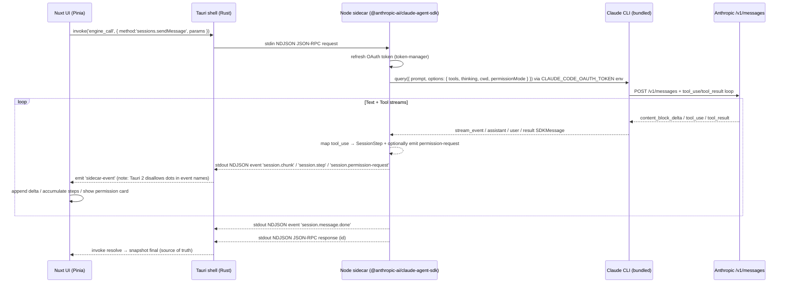

# Feature: Sessions

**Trạng thái:** Wired (M7+) — đã nối với Node.js sidecar `@anthropic-ai/claude-agent-sdk` + Anthropic Pro/Max OAuth. Tool-use + permission prompts fully integrated.

## Mục đích

`Sessions` là chỗ user **chat free-form với Claude** trong AWOG, không gắn workflow, không gắn agent persona, lưu lịch sử local. Mục tiêu: thay thế việc mở web `claude.ai` cho các tình huống "hỏi nhanh", "scratch pad", "research mở", trong khi vẫn tận dụng subscription Pro/Max mà user đã trả tiền.

Claude Code tools (Read/Write/Edit/Bash/Glob/Grep/WebSearch/WebFetch/Task…) được kích hoạt mặc định — user có thể chạy các lệnh shell + tệp I/O trực tiếp trong session, kèm permission prompts nếu cần.

## Khác Task

Session = thảo luận tự do (linear chat, không status pipeline, không approval). Task = đơn vị deliverable có workflow DAG, agent cố định, approval gate, artifact đầu ra. Xem chi tiết paradigm separation trong [MEMORY.md](../../MEMORY.md) (`feedback_session_vs_task.md`).

## Data flow



**Khác biệt so với sessions.md cũ (pre-M7):**
- Runner giờ dùng `@anthropic-ai/claude-agent-sdk` `query()` thay vì raw fetch `/v1/messages`.
- SDK tự sinh child process Claude CLI (bundled) — sidecar không cần spawn riêng.
- Tool-use chuyển từ "chưa support" sang "full support" (15 tools, mapping tới `SessionStep` union).
- Permission prompts: SDK emit permission_request event → sidecar reemit → UI render inline card.
- Cancel: per-message AbortController trong ACTIVE_ABORTERS Map, RPC `sessions.cancel` trigger abort.
- Plan mode: auto-toggle khi step label là "Enter plan" / "Exit plan".

Tham chiếu kiến trúc: [ADR 0006](../decisions/0006-tauri-shell-for-nuxt.md), [ADR 0008](../decisions/0008-stdio-ipc-for-sidecar.md).

## RPC methods

| Method | Params | Trả về | Ghi chú |
|---|---|---|---|
| `sessions.list` | — | `Session[]` (snapshot fold) | Đọc toàn bộ `~/.awog/sessions/*.jsonl`, fold event → snapshot trong RAM. |
| `sessions.upsert` | `{ mode: 'create' \| 'update-metadata', session }` | `Session` | Ghi event `session.created` hoặc `session.metadata.updated`. |
| `sessions.delete` | `{ id }` | `{ ok: true }` | Ghi event `session.deleted` (tombstone), file JSONL giữ lại cho forensics. |
| `sessions.sendMessage` | `{ sessionId, content, model?, projectId? }` | `{ messageId, text, modelUsed, usage, stopReason }` | Streaming. Sidecar invoke SDK query, emit chunks/steps/permissions via notifications. User + agent message tự append vào JSONL. Response RPC = source of truth khi xong. |
| `sessions.cancel` | `{ sessionId, messageId }` | `{ ok: true }` | Trigger abort trên AbortController của messageId. SDK unwind gracefully → emit partial text + set `message.canceled: true`. |
| `sessions.permission` | `{ requestId, decision: 'allow' \| 'deny', alwaysAllow?, updatedInput? }` | `{ ok: true }` | Resolve permission request (blocking call in SDK loop). |

UI gọi qua composable `useSidecar()` ([apps/desktop/ui/composables/useSidecar.ts](../../apps/desktop/ui/composables/useSidecar.ts)), wrap `invoke('engine_call', …)`.

## Persistence (Event-sourced JSONL)

Append-only JSONL tại `~/.awog/sessions/<sessionId>.jsonl`. 3 event types (bên UI — steps **không** persist, chỉ lưu dưới RAM):

| Event | Trigger | Body chính |
|---|---|---|
| `session.created` | `sessions.upsert` mode `create` | `{ id, title, createdAt }` |
| `session.metadata.updated` | rename, pin, set model/settings | partial metadata (gồm `disabledTools` nếu user chỉnh tool allowlist) |
| `message.appended` | trong `sessions.sendMessage` (cả user lẫn agent) | `{ messageId, role, content, model, tokensIn, tokensOut, durationMs, canceled?, steps? }` |
| `session.deleted` | `sessions.delete` | `{ deletedAt }` |

**Limitation (M7):** `steps` field chưa có trong JSONL — khi reload session, step history không restore, chỉ có text message. Sẽ implement post-M7.

Khi load (`sessions.list`):

1. Đọc tất cả file JSONL trong `~/.awog/sessions/`.
2. Mỗi file fold tuần tự event → snapshot `Session`.
3. Bỏ qua session có event `session.deleted` cuối cùng (vẫn giữ file).

File preserve sau delete để có thể audit hoặc khôi phục thủ công.

## Streaming & Tool-use protocol

Sidecar emit qua channel `sidecar-event` (Tauri event, không phải JSON-RPC response; lưu ý: Tauri 2 không cho dấu chấm):

```jsonc
// text delta
{ "jsonrpc": "2.0", "method": "event",
  "params": { "type": "session.chunk",
              "payload": { "sessionId", "messageId", "delta": "..." } } }

// tool step (may include permission inline)
{ "jsonrpc": "2.0", "method": "event",
  "params": { "type": "session.step",
              "payload": { "sessionId", "messageId", "step": SessionStep } } }

// permission request (blocking until sessions.permission reply)
{ "jsonrpc": "2.0", "method": "event",
  "params": { "type": "session.permission-request",
              "payload": { "sessionId", "messageId", "requestId", "toolName", "input", "promptSentence?", "displayName?", "description?", "decisionReason?", "blockedPath?", "suggestions[]" } } }

// terminal (end of turn)
{ "jsonrpc": "2.0", "method": "event",
  "params": { "type": "session.message.done",
              "payload": { "sessionId", "messageId", "tokensIn", "tokensOut", "model", "canceled?" } } }

// error
{ "jsonrpc": "2.0", "method": "event",
  "params": { "type": "session.error",
              "payload": { "sessionId", "messageId", "code", "message" } } }
```

### UI streaming logic

1. Trước `sessions.sendMessage`, store push placeholder `{ role: 'assistant', content: '', pending: true }` với `messageId`.
2. Subscribe `sidecar-event`, filter `payload.sessionId + payload.messageId`.
3. Mỗi `session.chunk` → append `delta` (RAF-buffered streaming).
4. Mỗi `session.step` → push vào `message.steps[]` array.
5. Mỗi `session.permission-request` → set `store.pendingPermission` (show inline card).
6. `session.permission-request` blocking — store.decision từ UI → RPC reply `sessions.permission` → SDK resume.
7. `session.message.done` → mark `pending: false`, optionally set `canceled: true` nếu abort.
8. RPC response (resolved) → replace placeholder bằng `finalMessage` (source of truth).

### Markdown + Mermaid live rendering

- Markdown render live (không gate trên `completedAt`) — `marked` instance + gfm + breaks + linebreak.
- Mermaid fences (` ```mermaid `) → placeholder `<div class="awog-mermaid" data-source="<b64>">`, lazy-load mermaid v11 sau step signature change.
- Heading color bind `--awog-accent` CSS var → reacts to appearance/accent theme.

### Steps summary chip

Aggregated summary ở message end: "ran X commands · read Y files · edited Z files · N searches · M subagents". Click → modal với full step list. ESC close.

## Composer features

### Follow-up (quote & instruct)

Cho phép user trích một đoạn trong message cũ của agent rồi đính kèm chỉ thị ngắn vào turn tiếp theo, thay vì copy/paste lại context.

**Flow:**

1. User bôi đen text trong agent message body — `selectionchange` listener phát hiện range nằm trọn trong một `[data-agent-message-id]`, hiển thị button "Quote & follow up" nổi sát selection (teleport `<body>`).
2. Click button → push `SessionFollowUp` vào `pendingFollowUps`. Chip xuất hiện trong composer (truncate hiển thị 140 ký tự — toàn văn được giữ trong state).
3. Click "Note" trên chip → mở textarea inline để gõ chỉ thị. "Done" để đóng.
4. Send → `composeOutgoingMessage` prepend từng follow-up dạng quote block markdown (`> …\n\n<note>`), nối với draft, rồi gửi nguyên text qua `sessions.sendMessage`. **Không truncate** quote phía agent-facing.

**State ownership:** `pendingFollowUps` thuộc `SessionChat` (parent của MessageList + Composer), expose qua `provide(FOLLOW_UP_KEY, …)`. Switch session → parent wipe, tránh stale state.

**Files:**
- [`utils/follow-up.ts`](../../apps/desktop/ui/utils/follow-up.ts) — `truncateForChip`, `formatFollowUp`, `composeOutgoingMessage`.
- [`utils/follow-up-context.ts`](../../apps/desktop/ui/utils/follow-up-context.ts) — `FOLLOW_UP_KEY` injection.
- [`components/session/SessionChat.vue`](../../apps/desktop/ui/components/session/SessionChat.vue) — orchestrator + state owner.
- [`components/session/SessionMessageList.vue`](../../apps/desktop/ui/components/session/SessionMessageList.vue) — selection detect.
- [`components/session/SessionComposer.vue`](../../apps/desktop/ui/components/session/SessionComposer.vue) — chip + note editor.

### Mention `@file` / `$agent` / `/command` `/skill`

Composer phát hiện trigger trong draft (tại con trỏ, sau khoảng trắng) và mở [`SessionAutocomplete.vue`](../../apps/desktop/ui/components/session/SessionAutocomplete.vue):

- **`@file`** — fuzzy toàn cây **file thật** của project gắn session. Lấy `workspaceRoot` từ `session.projectId`; nạp **lazy** (lần đầu gõ `@`) qua RPC [`fs.listFiles`](workspace-panel.md) rồi cache per-workspace ở [`useWorkspaceFileIndex.ts`](../../apps/desktop/ui/composables/useWorkspaceFileIndex.ts) (dedupe request in-flight). Match theo **tên + path**, xếp khớp-tên lên trước; hiển thị tối đa **50**, tiêu đề báo `N of M — type to narrow` khi còn nữa; path clip từ **trái** (giữ đuôi phân biệt các file trùng tên). Insert `@<relative-path>`.
- **`$agent`** — từ `workspace.agents` (live, hydrate sidecar).
- **`/command` / `/skill`** — `COMMANDS` tĩnh + `workspace.skills` (live).

**Sidecar-only:** cả ba nguồn rỗng trong browser dev thuần (`pnpm dev`, không Tauri → không sidecar). Agents/skills/files đều hydrate từ sidecar, **không seed mock** — test trong Tauri shell (`pnpm tauri:dev`) với session đã gắn project. State machine: [`useMentionAutocomplete.ts`](../../apps/desktop/ui/composables/useMentionAutocomplete.ts) (detect / apply / navigate).

### Tool permissions & allow-list

Composer chips popover có **Mode** chip gồm 4 mode (Ask / Accept Edits / Plan / Execute) + "Tools · X/Y" row:

- Click Info icon → Tools modal (Teleport, ESC/X close, Reset button).
- Modal lists 15 built-in tools trong 5 groups (File / Shell / Search / Web / Meta).
- Per-row toggle → update `session.disabledTools`.
- Passed to sidecar via `sessions.sendMessage` body → sidecar forward tới `Options.disallowedTools`.

**Catalog:** [`utils/tools-catalog.ts`](../../apps/desktop/ui/utils/tools-catalog.ts) với tool names + descriptions.

### Composer chips layout

Chips chia **2 hàng** quanh ô nhập. Component [`SessionChipsPopover.vue`](../../apps/desktop/ui/components/session/SessionChipsPopover.vue) nhận prop `only?: ChipKind[]` để lọc chip nào render; composer render component **2 lần** (trên + dưới).

- **Hàng trên ô nhập:** **Mode** (Ask / Accept Edits / Plan / Execute + "Tools · X/Y" row) và **MCP** (whitelist per-session over enabled servers).
- **Hàng dưới ô nhập:** **Account** + **Model**. Chip **Connection/Provider** đã bỏ — account đã ngụ ý provider (hiện chỉ Anthropic hoạt động). Bên phải hàng là **context status** = vòng ring + `%`; tên model nằm trong tooltip (tránh trùng với Model chip).
- **Model** — gộp Effort. Label = `Claude Opus 4.8 · High` (effort chỉ khi model hỗ trợ thinking). Popover: section MODELS + section EFFORT (Low…Max, disabled+greyed trên `maxLevel` của model).
- **Attach (📎):** nằm cạnh nút **Send** bên trong ô nhập (không còn ở toolbar).

### Per-session account (multi-account)

Mỗi session chọn account riêng → 2 session chạy **đồng thời** trên 2 account khác nhau. Account active trong Settings chỉ là **mặc định**.

- **Account chip** (hiện khi provider có ≥ 1 account): list account + dot trạng thái, badge `default` cho account active global, `✓` cho account đang hiệu lực; nút **"Follow active account"** để bỏ ghim.
- **Resolve:** `effectiveAccountId = session.settings.accountId ?? activeAccountId`. `accountId` undefined = bám theo active global; id cụ thể = ghim session (giữ nguyên kể cả khi đổi active global sau đó). Khớp logic với [`runner.resolveAccount`](../../apps/desktop/sidecar/src/sessions/runner.ts).
- **Token tách biệt:** runner inject OAuth token vào object `env` cục bộ per-query (không mutate `process.env`), lock theo `sessionId` → chạy song song an toàn.
- **Plan usage theo account:** [`SessionContextStatus.vue`](../../apps/desktop/ui/components/session/SessionContextStatus.vue) truyền `effectiveAccountId` vào RPC [`account.usage`](../../apps/desktop/sidecar/src/methods/account.usage.ts); đổi account → refetch ngay (cache sidecar keyed per-account, không lẫn số liệu).

Field lưu: `SessionSettings.accountId?: string` ([types](../../apps/desktop/ui/types/index.ts)).

### Auto-title & plan-mode toggle

- **Auto-title:** Khi user gửi message đầu tiên trong session có title còn "Untitled session", title tự replace bằng first 60 chars của message (single-line).
- **Plan-mode auto-toggle:** Khi sidecar emit step với label "Enter plan" / "Exit plan", `session.settings.mode` flips từ 'ask' ↔ 'plan'.

## Subagent drawer

Khi user click trên một Tool step (Read/Write/Edit/Bash/Glob…), drawer slide-in từ phải hiển thị:

- Prompt (collapsed, clickable).
- Reply (markdown-rendered).
- Store state: `subagentDrawerRef: { sessionId, messageId, stepId }` + getter `activeSubagentStep`.
- Realtime: khi step transitions running → done, step.status update → drawer content auto-update.

**File:** [`components/session/SessionSubagentDrawer.vue`](../../apps/desktop/ui/components/session/SessionSubagentDrawer.vue). Activate via `provide(SELECT_STEP_KEY)` trong SessionMessageList.

## Composer send/cancel

- **Send button:** Bình thường gửi tin nhắn.
- **Cancel (Stop button):** Khi streaming (`store.isSessionStreaming(sessionId)`), button swap sang Square icon (danger color).
  - Click → RPC `sessions.cancel { sessionId, messageId }`.
  - Sidecar abort AbortController → SDK unwind → emit partial text + `session.message.done { canceled: true }`.
  - UI preserve text với `message.canceled: true` (không replace bằng `[error] CANCELED`).

## OAuth token refresh & error handling

Sidecar `token-manager` pre-refresh 5 phút trước expiry. Khi `/v1/messages` trả `401`:

1. Force refresh (bỏ qua window).
2. Retry 1 lần.
3. Vẫn fail → propagate `AUTH_EXPIRED` ra RPC; UI prompt sign-in lại.

Mỗi refresh response trả `refresh_token` mới → overwrite cả token + refresh trong file + memory. Xem [ADR 0011](../decisions/0011-anthropic-subscription-oauth.md).

## Limitations (M7+)

- Chỉ text (chưa multimodal: image/file attachment).
- Steps **không** persist JSONL — reload session mất step history (chỉ có message text).
- Chưa surface `thinking` blocks (Claude extended thinking, xACBudgetTokens) ra UI — SDK accumulate nhưng UI không hiển thị chi tiết.
- Multi-provider chưa có — chỉ Anthropic OAuth. OpenAI / Google / custom provider thuộc roadmap (xem [models-and-accounts.md](./models-and-accounts.md#todo-post-m7)).
- Chưa search trong nội dung message (chỉ filter trên title).
- Chưa promote-session-to-task / fork / branch.
- Subagent drawer hiện chỉ cho Tool steps (có input/output). Plan/thinking steps không có drawer.

## Tools support

Runner backend `@anthropic-ai/claude-agent-sdk` default tool preset:

| Tool | Mapping tới SessionStep | Ghi chú |
|---|---|---|
| Read | `read` | Đọc file. |
| Write | `write` | Tạo file mới. |
| Edit / MultiEdit / NotebookEdit | `edit` | Sửa file / notebook. |
| Bash / BashOutput | `terminal` | Chạy shell command. |
| Glob | `find-files` | Tìm file theo pattern. |
| Grep | `search` | Tìm text trong file. |
| WebSearch / WebFetch | `search` | Tìm web resource. |
| Task / TodoWrite / EnterPlanMode / ExitPlanMode | `task` | Generic task / plan toggle. |

Default: **tất cả tools enabled**. User có thể disable từng tool qua Tools modal trong Composer (update `session.disabledTools`).

Permission prompts: SDK emit `permission_request` event nếu `permissionMode: 'default'` + `canUseTool` callback từ chối. Sidecar map tới UI `session.permission-request` notification → UI render inline permission card.

**Files:**
- [`apps/desktop/sidecar/src/sessions/step-mapper.ts`](../../apps/desktop/sidecar/src/sessions/step-mapper.ts) — tool name → SessionStep mapping.
- [`apps/desktop/ui/utils/tools-catalog.ts`](../../apps/desktop/ui/utils/tools-catalog.ts) — UI tool list + description.

## Files chính

### UI

- [`apps/desktop/ui/pages/sessions/index.vue`](../../apps/desktop/ui/pages/sessions/index.vue) — route + layout chat.
- [`apps/desktop/ui/stores/sessions.ts`](../../apps/desktop/ui/stores/sessions.ts) — Pinia store, action `fetchAll`, `sendMessage`, `cancelMessage`, `rename`, `remove`.
- [`apps/desktop/ui/components/session/`](../../apps/desktop/ui/components/session/) — `SessionChat`, `SessionMessageList`, `SessionComposer`, `SessionChipsPopover`, `SessionSubagentDrawer`, …
- [`apps/desktop/ui/composables/useSidecar.ts`](../../apps/desktop/ui/composables/useSidecar.ts) — wrapper `invoke` + `listen`.
- [`apps/desktop/ui/utils/markdown.ts`](../../apps/desktop/ui/utils/markdown.ts) — render markdown qua `marked` (gfm + breaks).
- [`apps/desktop/ui/utils/mermaid.ts`](../../apps/desktop/ui/utils/mermaid.ts) — lazy-load mermaid v11, render diagrams.
- [`apps/desktop/ui/utils/notify.ts`](../../apps/desktop/ui/utils/notify.ts) — Web Notification API for permission requests.

### Sidecar

- [`apps/desktop/sidecar/src/sessions/runner.ts`](../../apps/desktop/sidecar/src/sessions/runner.ts) — SDK query builder + stream handler + thinking budget mapping.
- [`apps/desktop/sidecar/src/sessions/step-mapper.ts`](../../apps/desktop/sidecar/src/sessions/step-mapper.ts) — SDK tool_use/tool_result → SessionStep.
- [`apps/desktop/sidecar/src/methods/sessions.send-message.ts`](../../apps/desktop/sidecar/src/methods/sessions.send-message.ts) — RPC handler + JSONL append.
- [`apps/desktop/sidecar/src/methods/sessions.cancel.ts`](../../apps/desktop/sidecar/src/methods/sessions.cancel.ts) — RPC handler for abort.
- [`apps/desktop/sidecar/src/methods/sessions.permission.ts`](../../apps/desktop/sidecar/src/methods/sessions.permission.ts) — RPC handler to resolve permission.
- [`apps/desktop/sidecar/src/sessions/store.ts`](../../apps/desktop/sidecar/src/sessions/store.ts) — JSONL event fold + snapshot cache.
- [`apps/desktop/sidecar/src/transport/`](../../apps/desktop/sidecar/src/transport/) — stdio reader + JSON-RPC dispatch.
- [`apps/desktop/sidecar/src/credentials/token-manager.ts`](../../apps/desktop/sidecar/src/credentials/token-manager.ts) — OAuth token refresh + caching.

## Tham chiếu

- [ADR 0006](../decisions/0006-tauri-shell-for-nuxt.md) — Tauri shell architecture.
- [ADR 0008](../decisions/0008-stdio-ipc-for-sidecar.md) — stdio NDJSON JSON-RPC protocol.
- [ADR 0010](../decisions/0010-pause-on-quota-for-connection-switch.md) — handling 429 quota.
- [ADR 0011](../decisions/0011-anthropic-subscription-oauth.md) — OAuth Pro/Max + token quirks.
- [models-and-accounts.md](./models-and-accounts.md) — account + provider management.
